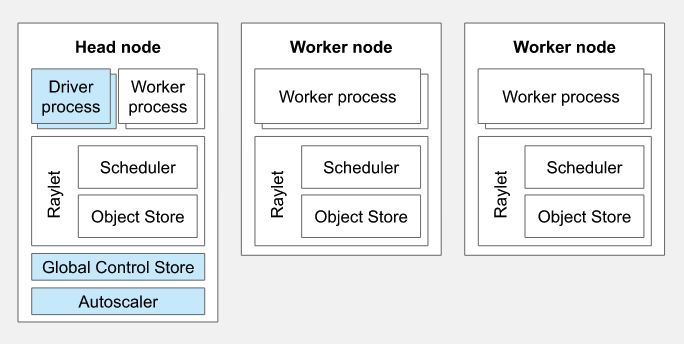

# Ray on Kubernetes

[Ray](https://www.ray.io/) is an open source framework for building AI Applications applications. It provides a simple, universal API for building applications that scale from a single machine to a large cluster. Ray is packaged with RLlib, a scalable reinforcement learning library, and Tune, a scalable hyperparameter tuning library.

Ray Applications can be deployed on Kubernetes. KubeRay is a Kubernetes operator that manages Ray clusters on Kubernetes. It is built on top of the [Ray Cluster Launcher](https://docs.ray.io/en/master/cluster/launcher.html) and the [Ray Autoscaler](https://docs.ray.io/en/master/cluster/autoscaling.html).

Step 1: Create a KinD cluster 
`kind create cluster`

Step 2: Register a Helm chart repo
`helm repo add kuberay https://ray-project.github.io/kuberay-helm/`

Step 3: Install both CRDs and KubeRay operator v0.4.0.
`helm install kuberay-operator kuberay/kuberay-operator --version 0.4.0`

This installs 3 CRDS and the KubeRay operator. The CRDs are:

`kubectl get crds`

```bash
NAME                 CREATED AT
rayclusters.ray.io   2023-04-02T17:36:34Z
rayjobs.ray.io       2023-04-02T17:36:34Z
rayservices.ray.io   2023-04-02T17:36:35Z
```

And the operator is installed as a pod:

`kubectl get pods`

```bash
NAME                                READY   STATUS    RESTARTS   AGE
kuberay-operator-779cd9996b-vwjbq   1/1     Running   0          62s
```

Ray Cluster consists of a head node and worker nodes. The head node is responsible for scheduling tasks and the worker nodes execute the tasks. The head node also hosts a Ray Dashboard which can be used to monitor the cluster.



Usually a head or worker would be a machine. Using KubeRay, we can create a Ray cluster on Kubernetes. The head and worker nodes are pods in the cluster.

Step 4: Install a RayCluster custom resource
(For x86_64)
`helm install raycluster kuberay/ray-cluster --version 0.4.0`

(For arm64 Mac M1)

`helm install raycluster kuberay/ray-cluster --version 0.4.0 --set image.tag=nightly-aarch64`
(more images https://hub.docker.com/r/rayproject/ray/tags?page=1&name=aarch64)

Step 5: Verify the installation of KubeRay operator and RayCluster
`kubectl get pods`

```bash
NAME                                          READY   STATUS              RESTARTS   AGE
kuberay-operator-779cd9996b-vwjbq             1/1     Running             0          25m
raycluster-kuberay-head-kn796                 0/1     ContainerCreating   0          37s
raycluster-kuberay-worker-workergroup-5qmpc   0/1     Init:0/1            0          37s
```

Step 6: Forward the port of Dashboard
`kubectl port-forward --address 0.0.0.0 svc/raycluster-kuberay-head-svc 8265:8265`

Step 7: Check for the Dashboard: 127.0.0.1:8265

Step 8: Log in to Ray head Pod and execute a job.
`kubectl exec -it ${RAYCLUSTER_HEAD_POD} -- bash python -c "import ray; ray.init(); print(ray.cluster_resources())"` (in Ray head Pod)

Step 9: Check ${YOUR_IP}:8265/#/job. The status of the job should be "SUCCEEDED"