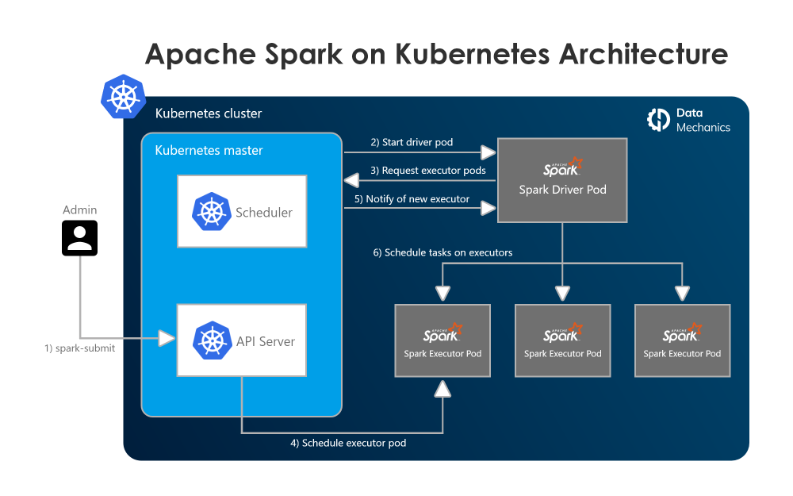

# Machine Learning Platforms on Kubernetes

Use the following command to start a KIND cluster:

`kind create cluster`

We will use the following command to install the Spark Operator. We can use [MLLib](https://spark.apache.org/mllib/) from Spark to run ML jobs on Kubernetes.

`$ helm repo add spark-operator https://googlecloudplatform.github.io/spark-on-k8s-operator`

`$ helm install my-release spark-operator/spark-operator --namespace spark-operator --create-namespace`

Check if the operator has been installed

`$ kubectl get pods -n spark-operator`

You should see the following output:

```bash
NAME                                         READY   STATUS    RESTARTS   AGE
my-release-spark-operator-6646fb584d-rndgp   1/1     Running   0          31m
```

This operator creates extra pods in the cluster for the driver and executor when a job is submitted. 



Two CRDS are created when the operator is installed. These are `SparkApplication` and `ScheduledSparkApplication`.

```bash
NAME                                              CREATED AT
scheduledsparkapplications.sparkoperator.k8s.io   2023-04-02T14:36:26Z
sparkapplications.sparkoperator.k8s.io            2023-04-02T14:36:26Z
```

Create Service Account - helm chart does not create a service account for the operator. We will create one using the following command:

`kubectl apply -f spark-rbac.yaml`

TODO: fix the SA for spark

Submit spark job:
`kubectl apply -f spark-pi.yaml`

Status of the job can be checked using the following command:
`kubectl get sparkapplication`

The operator creates a driver and executor which can be seen by running:
`kubectl get pods`
